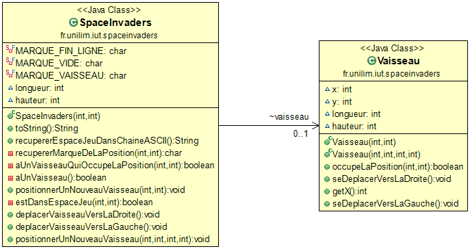
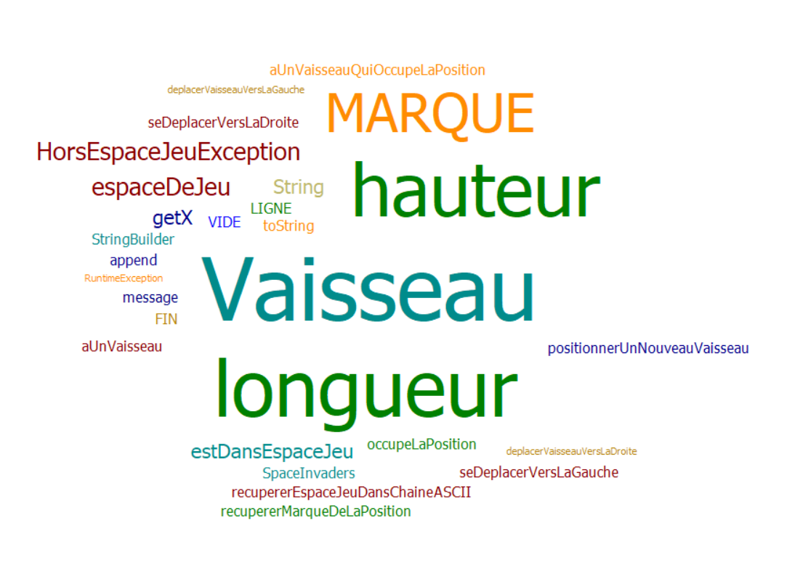
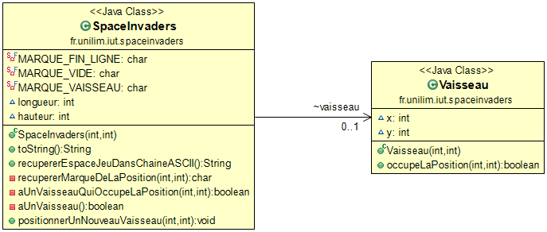
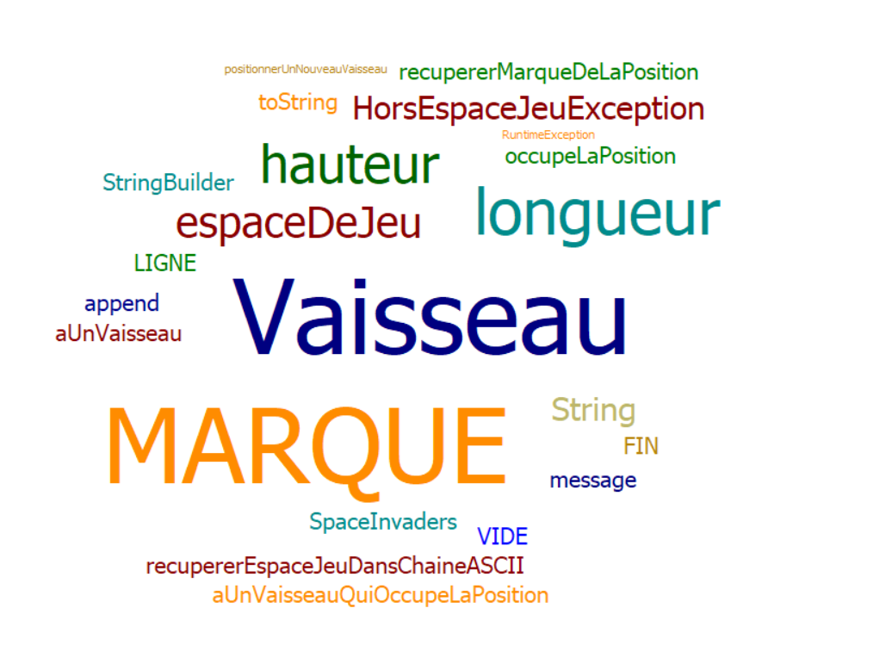

# Space Invaders 

- [Semaine n°3 : du 3 juin au 9 juin](#semaine3)
- [Semaine n°2 : du 26 avril au 2 juin ](#semaine2)  
- [Glossaire](#glossaire)

## Semaine n°3 : du 3 juin au 9 juin] 

### Sprints et fonctionnalités réalisées 
Fonctionnalité n°1 :  Déplacer un vaisseau dans l'espace de Jeu qui consiste à :

### Fonctionnalité en cours d'implémentation 
Fonctionnalité n°2 :  Dimensionner le vaisseau qui consiste à :

-positionner un nouveau vanisseau avec une dimension donnée

-faire en sorte qu'il soit impossible de positionner un nouveau vaisseau qui déborde de l'espace de jeu

-déplacer un vaisseau en tenant compte de sa dimension

### Diagramme de classes 

### Nuage de mots 

### Difficultés rencontrées 
Aucune

### Remarques diverses
Pas de remarque particulière

------------- 

## Semaine n°2 : du 26 avril au 2 juin 

### Sprints et fonctionnalités réalisées 

### Fonctionnalité en cours d'implémentation 
Fonctionnalité n°1 :  Déplacer un vaisseau dans l'espace de Jeu qui consiste à :

- créer un espace de jeu
Il faut créer une grille où différents objets peuvent être placés 
- positionner un nouveau vaisseau dans l'espace de jeu
Il faut que le vaisseau apparaisse en bas de l'espace de jeu et que sa position soit parmis l'espace de jeu
- déplacer le vaisseau vers la droite dans l'espace de jeu
Il faut qu'à partir de notre position initiale, on puisse déplacer le vaisseau vers la droite sans sortir de l'espace de jeu
- déplacer le vaisseau vers la gauche dans l'espace de jeu
Pareil, sauf que cette fois il faut le déplacer vers la gauche

Les deux premières stories ont déjà été réalisées.

### Diagramme de classes 

### Nuage de mots 

### Difficultés rencontrées 
Aucune

### Remarques diverses
Pas de remarque particulière

-------------

## Glossaire 

* **Vaisseau** :  véhicule commandé par le joueur, pouvant se déplacer de droite à gauche et ayant la possibilité de lancer des missiles destinés à détruire le(s) envahisseurs.

* **Envahisseur**  :  ennemi qui apparaît à l'écran, se déplace automatiquement et qui doit être détruit par un missile lancé depuis le vaisseau du joueur.

* **Missile** :  projectile envoyé à la verticale par le vaisseau vers l'envahisseur dans le but de le détruire.

------------- 

